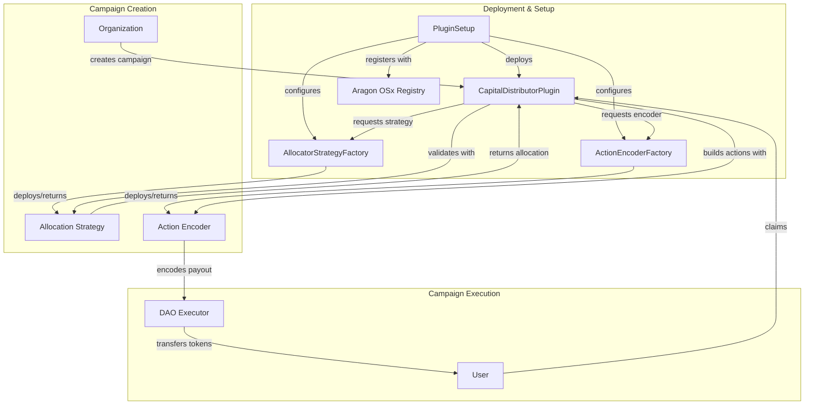

# Capital Distributor [![Open in Gitpod][gitpod-badge]][gitpod] [![Github Actions][gha-badge]][gha] [![Foundry][foundry-badge]][foundry] [![License: AGPL v3][license-badge]][license]

[gitpod]: https://gitpod.io/#https://github.com/aragon/osx-capital-distributor
[gitpod-badge]: https://img.shields.io/badge/Gitpod-Open%20in%20Gitpod-FFB45B?logo=gitpod
[gha]: https://github.com/aragon/osx-capital-distributor/actions
[gha-badge]: https://github.com/aragon/osx-capital-distributor/actions/workflows/ci.yml/badge.svg
[foundry]: https://getfoundry.sh/
[foundry-badge]: https://img.shields.io/badge/Built%20with-Foundry-FFDB1C.svg
[license]: https://www.gnu.org/licenses/agpl-3.0
[license-badge]: https://img.shields.io/badge/License-AGPL%20v3-blue.svg

## Overview

Capital Distributor is an Aragon OSx plugin that enables onchain organizations to create and manage capital distribution campaigns. Organizations can distribute tokens to their members through various allocation strategies and payout methods, making it ideal for airdrops, gauge distributions, incentive programs, grants, and rewards.

## Architecture

The system follows a modular architecture where the main plugin orchestrates campaigns using dynamically deployed strategies and encoders through factory contracts:



## Core Components

### CapitalDistributorPlugin
The main plugin contract that manages the lifecycle of distribution campaigns. It handles:
- Campaign creation with customizable parameters
- Claim processing and validation
- Campaign state management (active, paused, ended)
- Integration with allocation strategies and payout encoders

### Factory Contracts

#### AllocatorStrategyFactory
Manages the deployment and registration of allocation strategies. Each strategy determines how tokens are allocated to recipients.

**Available Strategies:**
- **MerkleDistributorStrategy**: Uses Merkle trees for efficient large-scale distributions (airdrops)
- **GaugeVoterAllocatorStrategy**: Allocates based on gauge voting weights (incentive programs)
- **CallBasedAllocatorStrategy**: Delegates allocation logic to external contracts (custom logic)

#### ActionEncoderFactory
Manages payout action encoders that transform distribution amounts into executable DAO actions.

**Available Encoders:**
- **Direct Transfer**: Simple ERC20 token transfers
- **VaultDepositPayoutActionEncoder**: Deposits tokens into ERC-4626 vaults
- **SablierLinearPayoutActionEncoder**: Creates token streams for vesting schedules

### Campaign Structure
```solidity
struct Campaign {
    bytes metadataURI;              // Campaign metadata (IPFS)
    IAllocatorStrategy strategy;     // Allocation logic
    IERC20 token;                    // Token to distribute
    IPayoutActionEncoder encoder;    // Payout method
    bool multipleClaimsAllowed;      // Allow multiple claims per user
    CampaignState state;             // ACTIVE, PAUSED, ENDED
    uint256 startTime;               // Campaign start timestamp
    uint256 endTime;                 // Campaign end timestamp
}
```

## Features

- **Flexible Allocation Strategies**: Choose from multiple methods to determine recipient allocations
- **Multiple Payout Methods**: Direct transfers, vault deposits, or streaming payments
- **Campaign Management**: Full lifecycle control with pause, resume, and end capabilities
- **Batch Operations**: Process multiple claims in a single transaction for gas efficiency
- **Modular Architecture**: Easily extend with new strategies and encoders
- **Permission System**: Integrated with Aragon's permission management
- **Event Tracking**: Comprehensive events for monitoring and indexing

## Installation

### Prerequisites
- [Foundry](https://getfoundry.sh/) development framework
- [Bun](https://bun.sh/) or Node.js package manager
- Git

### Setup

Clone the repository and install dependencies:

```bash
git clone https://github.com/aragon/osx-capital-distributor
cd osx-capital-distributor
bun install # or npm install
```

## Build & Test

### Build
The project **must** be built with the `--via-ir` flag for optimization:

```bash
forge build --via-ir
```

### Test
Run the test suite with verbose output:

```bash
forge test --via-ir -vvv
```

### Coverage
Generate test coverage report:

```bash
forge coverage --via-ir
```

### Gas Analysis
Generate gas reports for optimization:

```bash
# Gas report for tests
forge test --gas-report --via-ir

# Create gas snapshot
forge snapshot --via-ir
```

## Deployment

The deployment process follows these steps:

1. **Deploy Factory Contracts**
   ```solidity
   AllocatorStrategyFactory allocatorFactory = new AllocatorStrategyFactory();
   ActionEncoderFactory actionFactory = new ActionEncoderFactory();
   ```

2. **Register Strategies and Encoders**
   ```solidity
   // Register allocation strategies
   allocatorFactory.registerStrategyType("merkle-distributor", merkleStrategy, ...);
   allocatorFactory.registerStrategyType("gauge-voter", gaugeStrategy, ...);
   
   // Register action encoders
   actionFactory.registerActionEncoder("vault-deposit", vaultEncoder, ...);
   actionFactory.registerActionEncoder("sablier-linear", sablierEncoder, ...);
   ```

3. **Deploy Plugin Setup**
   ```solidity
   CapitalDistributorPluginSetup setup = new CapitalDistributorPluginSetup();
   ```

4. **Publish to Aragon Registry**
   ```solidity
   PluginRepo repo = repoFactory.createPluginRepoWithFirstVersion(
       "capital-distributor",
       address(setup),
       maintainer,
       buildMetadata,
       releaseMetadata
   );
   ```

5. **Install Plugin in DAO**
   ```solidity
   DAO.createDao(daoSettings, pluginSettings);
   ```

### Deployment Script
Deploy using the provided script:

```bash
forge script script/Deploy.s.sol --rpc-url <RPC_URL> --broadcast --via-ir
```

Required environment variables:
- `PLUGIN_REPO_FACTORY`: Aragon Plugin Repository Factory address
- `DAO_FACTORY`: Aragon DAO Factory address
- `ADMIN_REPO`: Admin plugin repository address
- `ADMIN_OWNER`: Address of the admin owner

## Deployment Addresses

| Network | Plugin Setup | AllocatorStrategyFactory | ActionEncoderFactory |
|---------|-------------|-------------------------|---------------------|
| Ethereum Mainnet | TBD | TBD | TBD |
| Polygon | TBD | TBD | TBD |
| Arbitrum One | TBD | TBD | TBD |
| Optimism | TBD | TBD | TBD |
| Base | TBD | TBD | TBD |
| Sepolia Testnet | TBD | TBD | TBD |

## Usage Examples

### Creating a Campaign

```solidity
// Example: Create an airdrop campaign with Merkle distribution
plugin.createCampaign(
    "ipfs://QmCampaignMetadata",     // Metadata URI
    "merkle-distributor",             // Strategy ID
    address(token),                   // Token to distribute
    "direct-transfer",                // Encoder ID (simple transfer)
    false,                           // Single claim per user
    block.timestamp,                 // Start immediately
    block.timestamp + 30 days        // End in 30 days
);
```

### Claiming from a Campaign

```solidity
// User claims their allocation with proof
bytes memory proof = abi.encode(merkleProof, amount);
plugin.claimCampaignPayout(campaignId, recipient, proof);

// Batch claim for multiple recipients
plugin.batchClaimCampaignPayout(campaignId, recipients, proofs);
```

## Security

- Built on battle-tested Aragon OSx framework
- Follows checks-effects-interactions pattern
- Comprehensive access control via Aragon permissions
- Input validation and bounds checking
- Events for all state changes

## Contributing

We welcome contributions! Please see our [Contributing Guidelines](CONTRIBUTING.md) for details.

### Development Setup

1. Fork the repository
2. Create your feature branch (`git checkout -b feature/AmazingFeature`)
3. Commit your changes (`git commit -m 'Add some AmazingFeature'`)
4. Push to the branch (`git push origin feature/AmazingFeature`)
5. Open a Pull Request

### Code Style

- Run formatter: `forge fmt`
- Run linter: `bun run lint`
- Follow Solidity style guide and NatSpec documentation

## License

This project is licensed under the GNU Affero General Public License v3.0 or later - see the [LICENSE](LICENSE) file for details.